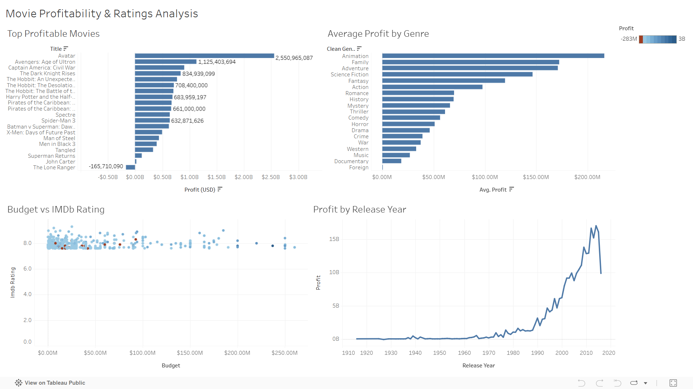

# 🎬 Movie Profitability & Ratings Analysis

## 📌 Project Overview

This project analyzes movie profitability and rating trends using SQL and Tableau.  
The objective was to identify high-performing genres, understand the relationship between budget and ratings, and uncover factors driving box office success.

---

## 🎯 Business Questions

- Which movie genres generate the highest average profit?
- Is there a strong relationship between budget and rating?
- How has profitability changed over release years?
- Which movies delivered the highest return on investment (ROI)?

---

## 🛠 Tools & Technologies

- SQL (Data Cleaning & Analysis)
- Google BigQuery
- Tableau (Dashboard & Visualization)
- CSV Data Processing

---

## 🧹 Data Preparation

- Cleaned and merged TMDb & IMDb datasets
- Removed duplicates and inconsistent entries
- Created calculated fields for:
  - Profit
  - ROI
  - Budget vs Revenue comparison
- Structured final analysis tables using SQL queries

All SQL queries used in the analysis are available inside the `queries/` folder.

---

## 📊 Dashboard Preview



The full interactive dashboard file is available as:
`movie_profitability_&_ratings_analysis.twbx`

---

## 📈 Key Insights

- Certain mid-budget genres produced higher ROI than high-budget films.
- Strong correlation observed between ratings and long-term profitability.
- Profitability trends vary significantly by release year.
- Genre diversification improves risk distribution in production investment.

---

## 📁 Repository Structure

```
datasets/   → Raw and cleaned movie datasets  
queries/    → SQL scripts used for analysis  
.twbx       → Tableau dashboard file  
.png        → Dashboard preview image  
README.md   → Project documentation
```

---

## 🚀 Future Improvements

- Add predictive modeling for box office forecasting
- Publish live dashboard using Tableau Public
- Integrate Python for advanced statistical analysis
